# TwitterSL v2 — End-to-End Workflow Guide

This document is the single source of truth for how the app behaves from boot to user-visible features. It covers frontend flow, backend data path, validation, and known gaps.

## 1. Architecture at a Glance

```mermaid
flowchart TD
    A[User] --> B[React UI]
    B --> C[App Layer\nsrc/lib/api]
    C --> D[Domain Layer\nsrc/lib/domain]
    C --> E[Infra Layer\nsrc/store + src/native]
    D --> E
    E --> F[(SQLite\n@capacitor-community/sqlite)]
    E --> G[Native Plugins\nFilesystem / Preferences / SecureStorage]
    C --> H[External HF / Model Endpoint]
```

## 2. Boot & Initialization

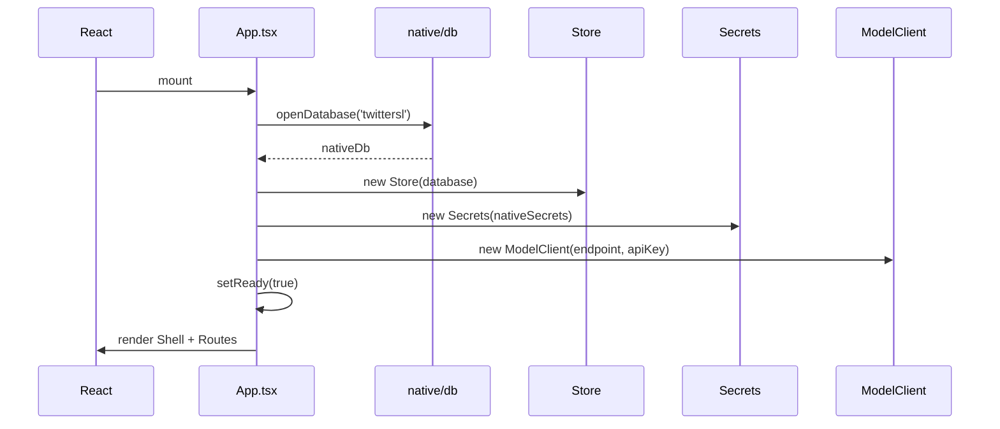

### Validation
- If boot throws, UI shows `Loading…` and logs `Boot failed:` to console.
- `Store` is the only writer to SQLite from the app layer.
- `Secrets` never logs endpoint or API key.

## 3. Feed & Posting

### 3.1 Feed Load

```mermaid
flowchart LR
    A[FeedPage] --> B{tab}
    B -->|foryou| C[SocialStore.rankFeed]
    B -->|following| D[SocialStore.listFeedFollowing]
    C --> E[Store.listPosts]
    C --> F[Store.listReplies]
    E --> G[domain/social.rankFeed]
    F --> G
    G --> H[ranked Post[]]
    D --> I[Store.listFollowing]
    D --> E
    I --> J[filter posts by author/following]
    J --> H
    H --> K[PostCard list]
```

### 3.2 Compose Post

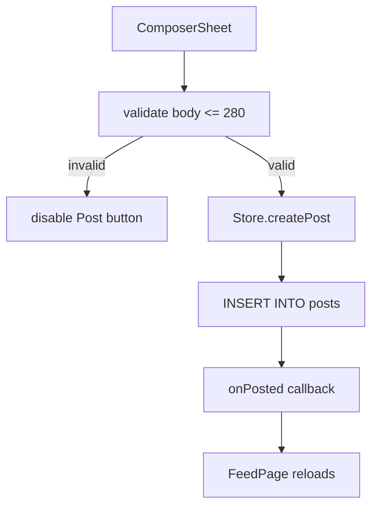

### Validation
- `MAX_POST_LEN = 280` enforced in `domain/post.ts` and `ComposerSheet`.
- Empty/whitespace posts are blocked client-side.
- `origin` is set to `offline` for user posts.

## 4. Thread & Replies

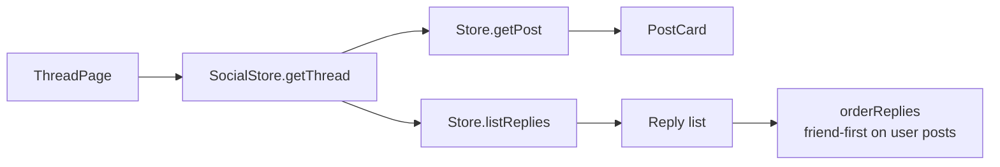

## 5. Profile

```mermaid
flowchart TD
    A[ProfilePage] --> B[Store.getUserProfile]
    A --> C[Store.listPosts('user')]
    A --> D[Store.listBookmarks]
    A --> E[Store.listFollowing]
    B --> F[display name / bio / handle]
    C --> G[posts tab]
    D --> H[bookmarks tab]
    E --> I[following count]
```

### Edit Profile Validation
- Display name max 24 chars.
- Bio max 160 chars.
- Handle is not editable in ProfilePage.

## 6. Notifications

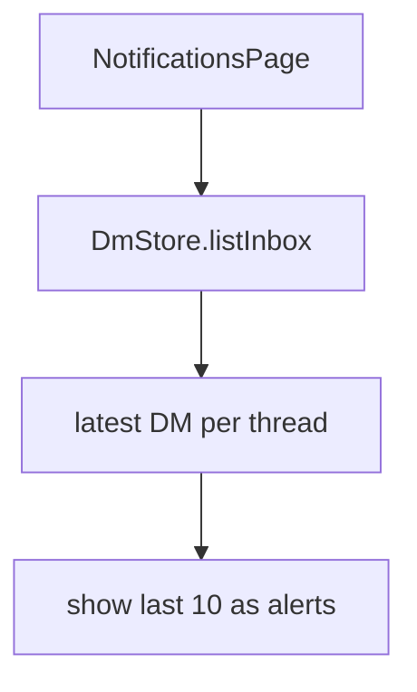

## 7. Direct Messages

### 7.1 Inbox

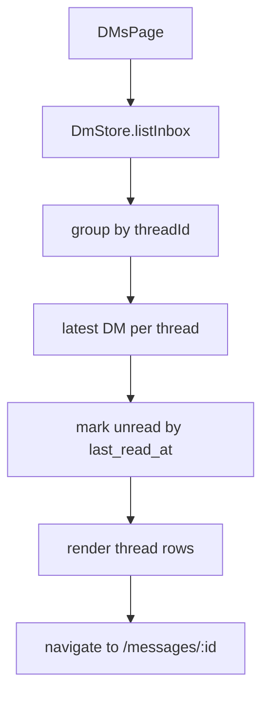

### 7.1 Chat

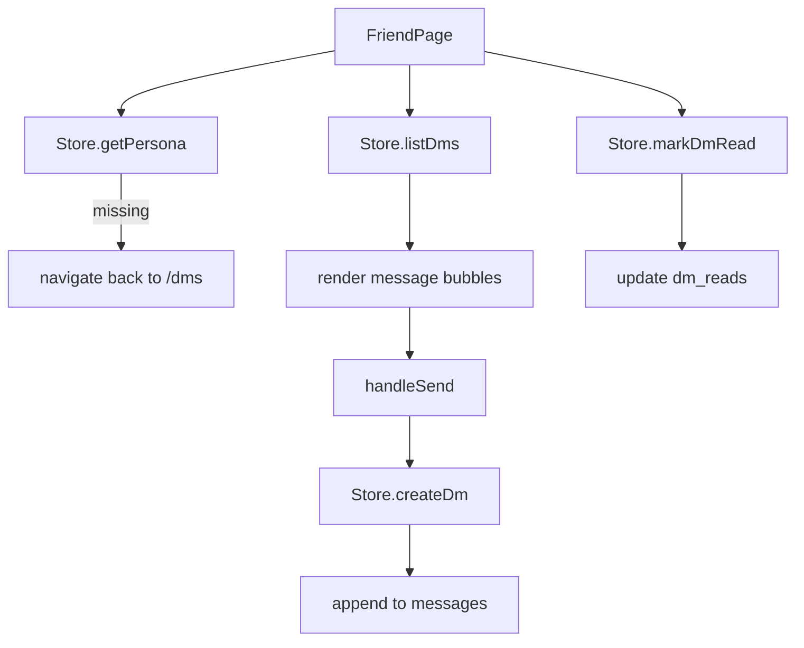

### Validation
- `threadId` format: `user:{personaId}` for user conversations.
- `senderId` is always `user` for user messages.
- Empty messages are blocked client-side.

## 8. Search

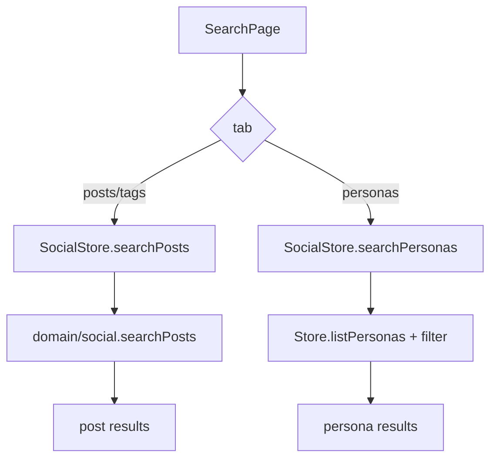

### Known Gap
- Tags tab reuses post search; no tag extraction/trending is wired yet.
- DM search is a placeholder.

## 9. Models Hub (HF)

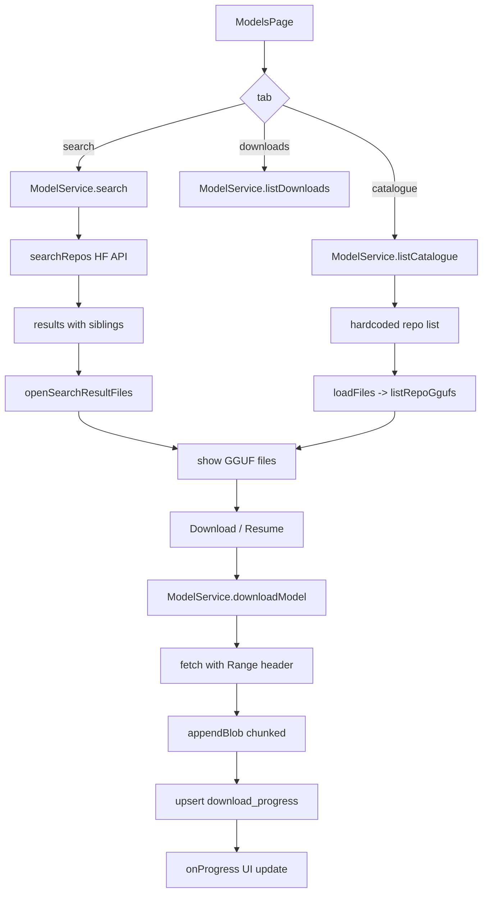

### Validation
- Download URLs now build path segments separately to avoid `%2F` in repo IDs.
- File sizes from HF search show `—` when unknown instead of `0 MB`.
- Interrupted downloads show `Resume` and reuse `Range` requests.

## 10. Settings & Configuration

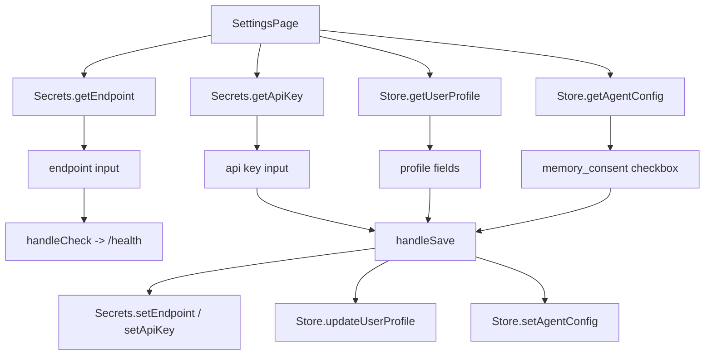

### Validation
- Endpoint health check uses 10s abort timeout.
- API key is cleared if input is blank.
- Profile save truncates display name to 24 and bio to 160.

## 11. Persona Profile & Actions

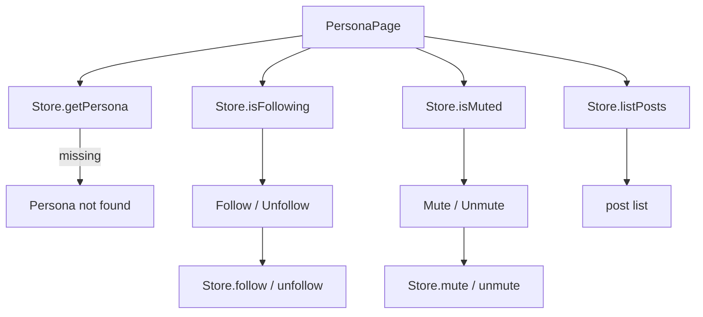

## 12. Backend Data Flow & Validation

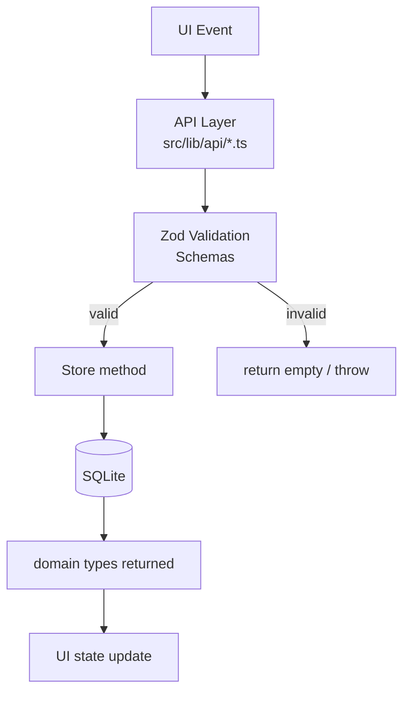

### Key Validation Rules
- All DB writes go through `Store` methods.
- `Post.body` max 280 chars.
- `Persona.affinity` is 0..1.
- `Dm.body` has no enforced max in DB, but UI input is plain text.
- `DownloadedModel` records are created only after successful download.
- `download_progress` is the source of truth for interrupted downloads.

## 13. Frontend Validation Summary

| Flow | Rule | Location |
|------|------|----------|
| Post | body <= 280, non-empty | ComposerSheet |
| Profile | displayName <= 24, bio <= 160 | SettingsPage |
| Search | query.trim() required | SearchPage |
| DM | body.trim() required | FriendPage |
| Models | file selection required, disabled while downloading | ModelsPage |
| Settings | endpoint health check 10s timeout | SettingsPage |

## 14. Known Gaps / Missing Features

| Feature | Status | Notes |
|---------|--------|-------|
| Onboarding / age-gate | Fixed | `/onboarding` with age + rules consent |
| Legal / privacy / terms | Fixed | `/legal` with tabs |
| App lock screen | Partial | `AppLock` component + manual Lock button in header |
| Background simulation engine | Partial | `background.ts` + Settings buttons for friend ping/weekly spawn |
| Daily world events | Partial | `world-events.ts` seeds/reads active event; `daily.ts` adds rotation logic |
| Image generation pipeline | Partial | Composer prompt creates `GeneratedImage`; PostCard renders visible placeholder |
| Notifications implementation | Partial | In-app alerts with unread highlighting; quiet-hours UI |
| BookmarkButton wiring | Fixed | Wired into `PostCard` post-actions |
| Memory approval UI | Fixed | Approve pending memories in Settings |
| Tag search / trending | Partial | Tags tab shows extracted tags with counts |
| DM search | Fixed | `DmStore.searchDms` + SearchPage DMs tab |
| Quote posts | Fixed | `/compose?quote=...` with quoted post preview |
| Post editing | Fixed | `/compose?edit=...` with pre-filled body |
| Polls | Fixed | Create polls in composer; vote bars in PostCard |
| Mute words | Fixed | Settings management + feed/search filtering |
| Privacy controls | Fixed | Protected-posts toggle in Settings |
| HF 400 on download | Fixed | Download URLs build path segments separately |
| HF 0 MB sizes | Fixed | Search sizes show `—` when unknown |
| Long-form posts | Product decision | MAX_POST_LEN=280 for microblogging simulation |
| Video/GIF uploads | Out of scope v1 | Placeholder media UI only; real upload needs cloud/transcoding |
| Push notifications | Cloud-dependent | In-app alerts implemented; push requires FCM/APNS |
| Analytics | Out of scope v1 | Local-first app; views/stats require telemetry backend |
| Creator tools | Out of scope v1 | Scheduling/thread composer outside local-first scope |
| Monetization | Out of scope v1 | Subscriptions/ads outside local-first scope |

## 15. How to Verify

```bash
# Type check
npm run check

# Unit tests
npm run test

# E2E smoke test
npm run test:e2e

# Production build
npm run build

# Android debug APK
cd android && ./gradlew assembleDebug
```

## 16. Quick Reference: Page Map

| Route | Page | Data Source |
|-------|------|-------------|
| `/` | FeedPage | SocialStore.rankFeed / listFeedFollowing |
| `/post/:id` | ThreadPage | SocialStore.getThread |
| `/profile` | ProfilePage | Store posts, bookmarks, following |
| `/notifications` | NotificationsPage | DmStore.listInbox |
| `/dms` | DMsPage | DmStore.listInbox |
| `/messages/:id` | FriendPage | Store.listDms |
| `/models` | ModelsPage | ModelService + HF API |
| `/settings` | SettingsPage | Secrets + Store |
| `/persona/:id` | PersonaPage | Store.getPersona + posts |
| `/search` | SearchPage | SocialStore.searchPosts / searchPersonas / searchDms |
| `/chatter` | ChatterPage | SocialStore.rankFeed |
| `/gazette` | GazettePage | SocialStore.rankFeed (last 24h) |
| `/compose` | ComposePage | New post / quote / edit / poll |
